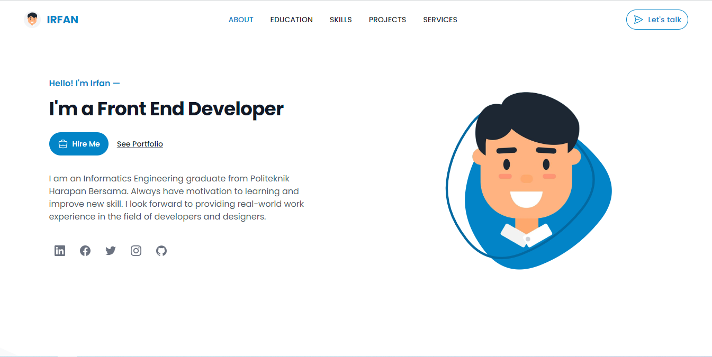
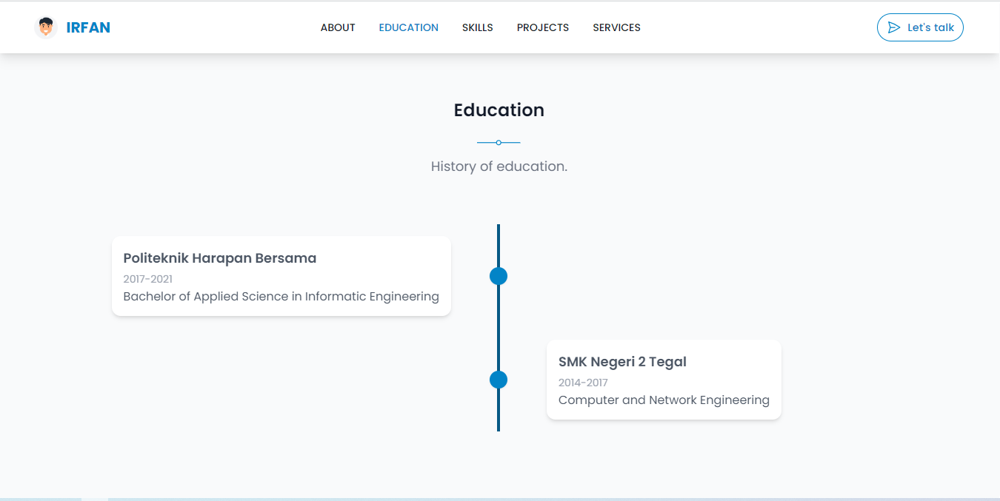
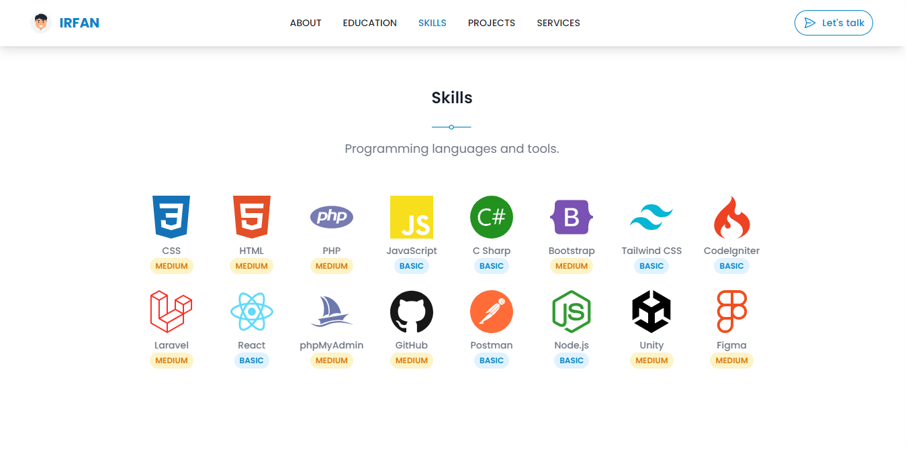
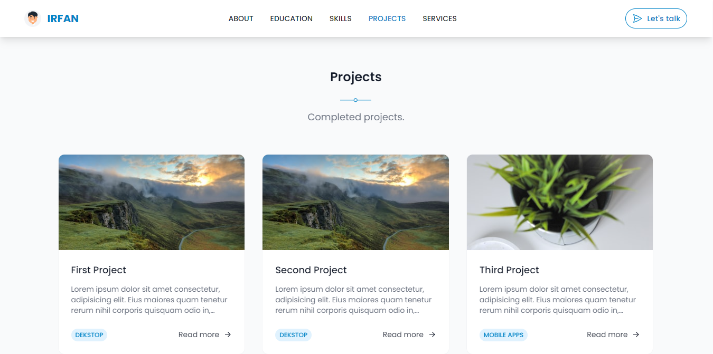
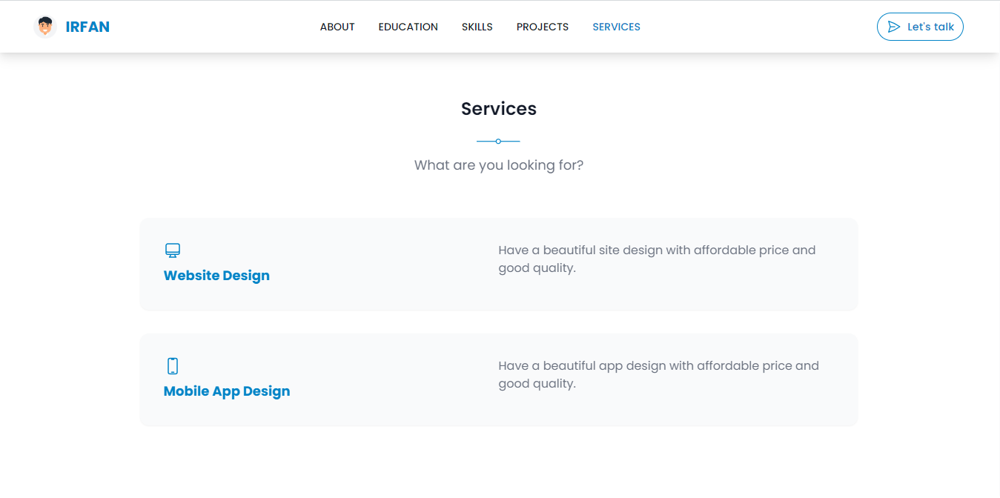
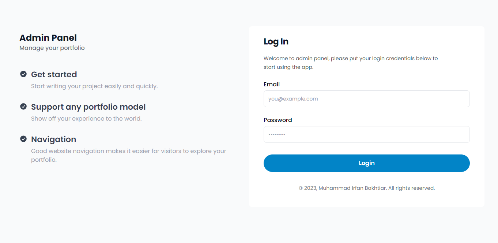
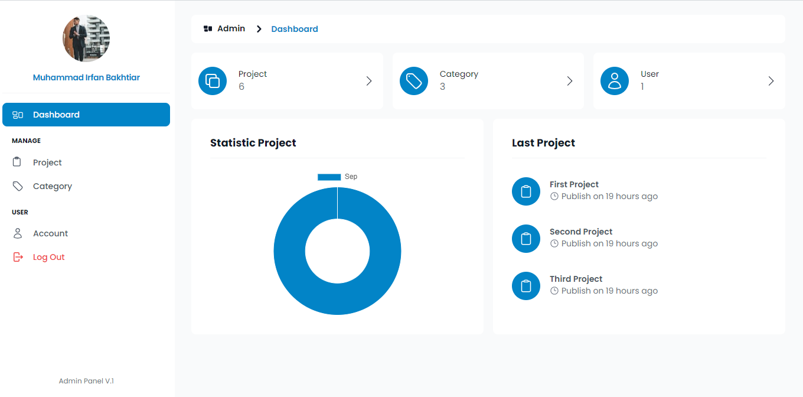

<!-- Improved compatibility of back to top link: See: https://github.com/othneildrew/Best-README-Template/pull/73 -->

<a name="readme-top"></a>

<!--
*** Thanks for checking out the Best-README-Template. If you have a suggestion
*** that would make this better, please fork the repo and create a pull request
*** or simply open an issue with the tag "enhancement".
*** Don't forget to give the project a star!
*** Thanks again! Now go create something AMAZING! :D
-->

<!-- PROJECT LOGO -->
<br />
<div align="center">
  <a href="https://github.com/irfanbakhtiar/larawind-portfolio">
    
  </a>

  <h3 align="center">Larawind Portfolio</h3>

  <p align="center">
    Start writing your portfolio easily and fun.
    <br />
    <a href="https://github.com/irfanbakhtiar/larawind-portfolio/issues">Report Bug</a>
<!--     ·
    <a href="https://github.com/irfanbakhtiar/larawind-portfolio/issue">Request Feature</a> -->
  </p>
</div>

<!-- ABOUT THE PROJECT -->

## About The Project

This project started when I wanted to create a website that was used to represent the results of the project I created. Many out there have made it like this, but I am more challenged to develop this portfolio website using existing references.

Why use this:

-   Make it easier for you to share the results of your projects with the world
-   Writing portfolios becomes more efficient anytime and anywhere
-   Responsive user interface

Of course, this project wouldn't be perfect without references from great people out there. Thanks to everyone for supporting me to develop this project!

### Built With

This project uses the following framework:

-   <a href="https://www.laravel.com">Laravel</a>
-   <a href="https://www.tailwindcss.com">Tailwind CSS</a>

This project uses the following tools & plugin:

-   <a href="https://github.com/basecamp/trix">Trix Editor</a>
-   <a href="https://github.com/cviebrock/eloquent-sluggable">Eloquent Sluggable</a>
-   <a href="https://github.com/tailwindlabs/tailwindcss-line-clamp">Line Clamp</a>

<!-- GETTING STARTED -->

## Getting Started

This is a step about setting up your project locally. To get a local copy up and running, follow these simple example steps.

### Prerequisites

To clone and run this application, you'll need [Git](https://git-scm.com) and [Node.js](https://nodejs.org/en/download/) (which comes with [npm](http://npmjs.com)) installed on your computer.

### Installation

_Below are the procedures for installing and setting up your app._

1. Clone the repo
    ```sh
    git clone https://github.com/irfanbakhtiar/larawind-portfolio.git
    ```
2. Install Composer
    ```sh
    composer install
    ```
3. Copy .env
    ```sh
    cp .env.example .env
    ```
4. Open .env change your field correspond to your configuration.
    ```sh
    DB_DATABASE
    ```
    ```sh
    DB_PASSWORD
    ```
5. Key generate
    ```sh
    php artisan key:generate
    ```
6. Migrate database
    ```sh
    php artisan migrate
    ```
7. Run server
    ```sh
    php artisan serve
    ```
8. Run your build process with new terminal
    ```sh
    npm run watch
    ```
9. <b>Don't forget</b> to symlink your storage
    ```sh
    php artisan storage:link
    ```

<!-- USAGE -->
<!-- ## Usage

Use this space to show useful examples of how a project can be used. Additional screenshots, code examples and demos work well in this space. You may also link to more resources. -->

<!-- LICENSE -->
<!-- ## License

Distributed under the MIT License. See `LICENSE.txt` for more information. -->

## Screenshot
#### Home Page
<details>
    <summary>Show</summary>
    
    
    
    
    
</details>

#### Admin Panel
<details>
    <summary>Show</summary>
    
    
</details>

<!-- CONTACT -->

## Contact

Muhammad Irfan Bakhtiar - m.irfanbakhtiar99@gmail.com<br>
Project Link: [https://github.com/irfanbakhtiar/larawind-portfolio](https://github.com/irfanbakhtiar/larawind-portfolio)

<!-- MARKDOWN LINKS & IMAGES -->
<!-- https://www.markdownguide.org/basic-syntax/#reference-style-links -->

[product-screenshot]: images/screenshot.png
[tailwindcss.com]: https://img.shields.io/badge/Tailwind%20CSS-06b6d4?style=for-the-badge&logo=tailwindcss&logoColor=white
[tailwindcss-url]: https://tailwindcss.com
[laravel.com]: https://img.shields.io/badge/Laravel-FF2D20?style=for-the-badge&logo=laravel&logoColor=white
